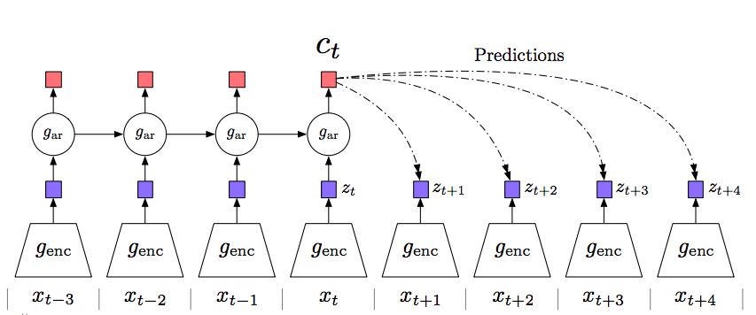

# Contrastive Predictive Coding for Natural Language

This repository contains a PyTorch implementation of CPC v1 for Natural Language (section 3.3) from the paper [Representation Learning with Contrastive Predictive Coding
](https://arxiv.org/abs/1807.03748).

<p align="center"> 
    
</p>

## Implementation Details

I followed the details mentioned in section 3.3. Also, I got missing details directly from one of the paper's authors.

**Embedding layer**
* vocabulary size: 20 000
* dimension: 620

**Encoder layer (g_enc)**
* 1D-convolution + ReLU + mean-pooling
* output dimension: 2400

**Recurrent Layer (g_ar)**
* GRU
* dimension: 2400

**Prediction Layer {W_k}**
* Fully connected
* timesteps: 3

**Extra details**
* batch of 64
* input is 6 sentences
* maximum sequence length of 32
* negative samples are drawn from both batch and time dimension in the minibatch
* uses Adam optimizer with a learning rate of 2e-4

## Requirements

## Usage Instructions

**Configuration File**

This implementation uses a configuration file for convenient configuration of the model. The `config_cpc.yaml` file includes original parameters by default.
You have to adjust the `logging_dir` and the `books_path` parameters to get started. 

Optionally, if you want to log your experiments with [comet.ml](https://www.comet.ml/), you just need to install the library and write your `api_key`.

**Dataset**

This model uses [BookCorpus](http://yknzhu.wixsite.com/mbweb) dataset for pretrainig. You have to organize your data according to the following structure:
```
├── BookCorpus
│   └── data
│       ├── file_1.txt
│       ├── file_2.txt 
```
Then you have to write the path of your dataset in the `books_path` parameter of the `config_cpc.yaml` file.

*Note: You could use publicly available files provided by [Igor Brigadir](https://twitter.com/IgorBrigadir/status/1095075607178870786) at your own risk.*

**Training**

When you have completed all the steps above, you can run:

``python train.py``

The implementation automatically saves a log of the experiment with the name `cpc-date-hour` and also saves the model checkpoints with the same name.

**Resume Training**

If you want to resume your model training, you just need to write the name of your experiment (`cpc-date-hour`) in the `resume_name` parameter of the `config_cpc.yaml` file and then run `train.py`.

## Results

The model should be trained for 1e8 steps with a batch size of 64 * 8 GPUs. The authors gave me a snapshot of the first 1M training steps that you can find [here](https://github.com/vgaraujov/CPC-NLP-PyTorch/blob/master/images/deepmind-train-plot.png), and you can find the results of my implementation [here](https://github.com/vgaraujov/CPC-NLP-PyTorch/blob/master/images/varaujov-trian-plot.jpg). There is a slight difference which may be due to various factors such as data set or initialization.

If anyone can fully train the model, feel free to share your results with us.

## References
* [Representation Learning with Contrastive Predictive Coding
](https://arxiv.org/abs/1807.03748)
* Part of the code is borrowed from https://github.com/jefflai108/Contrastive-Predictive-Coding-PyTorch

